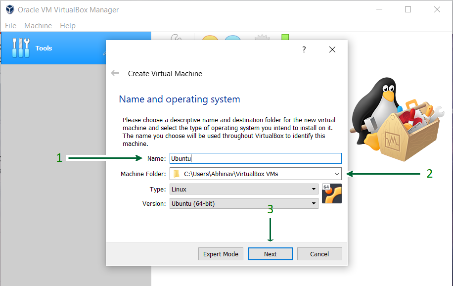
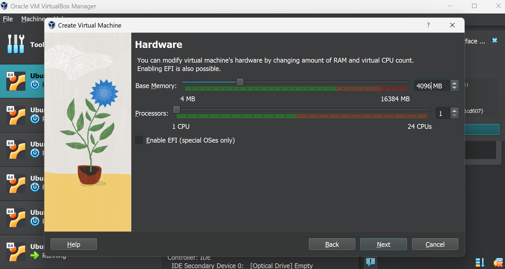
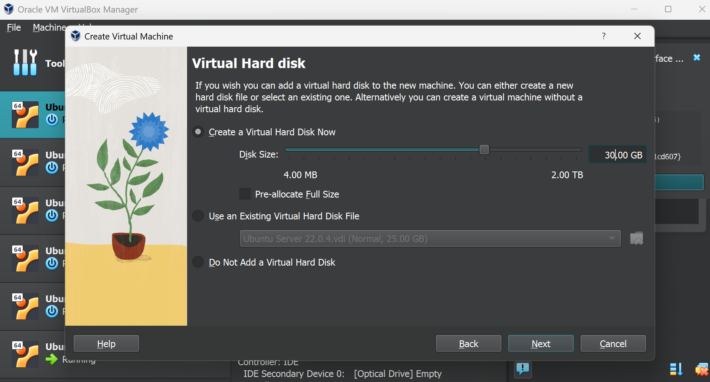

# Create VM Ubuntu 22.04 in Virtual Box

1. install iso ubuntu 22.04 : <a href='https://releases.ubuntu.com/jammy/ubuntu-22.04.4-desktop-amd64.iso' target='_blank'>Download Here</a>

2. After you download iso ubuntu 22.04 -> Open your Virtual Box and Create New Virtual Machine.

3. Give your virtual machine name with the name ubuntu, and the type is Linux and the version is Ubuntu(64-bit) and click next

4. For good performance Adjust RAM to 4GB (4096 MB) or less according to your system configuration. If it is appropriate Click Next

5. Let the "Create a virtual hard disk now" option selected and proceed to the next step

6. Select the type of Hard disk. Using VDI type is recommended.

7. Either of the Physical Storage types can be selected. Using a Dynamically Allocated Disk is by default recommended.

8. Select Disk Size and provide the Destination Folder to install and Allocate about Minimum 30GB of virtual space. and click Create

#### <a href='https://github.com/geetoor-maven/pentaho/blob/master/3_START_UBUNTU.md'>Next Step</a>