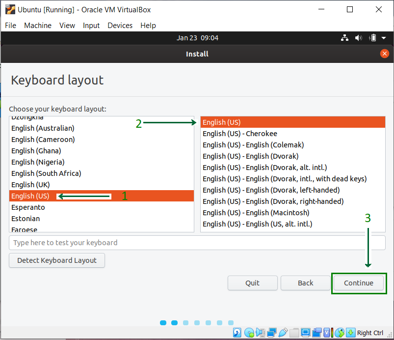

# Starting Ubuntu Virtual Machines 22.04

1. After all the steps above are complete, you will see a new virtual machine created on your virtualBox. Select it from the left side panel and press the Start button.

2. And then add ISO Ubuntu 22.04 that you have downloaded on the second step to virtual box

3. Click start and virtual machines begin.
4. You will see the grub menu as the first screen to choose "Ubuntu" to boot with it.
5. Click on the install ubuntu option
6. Select keyboard layout, if the defaults are compatible, just click on the continue button and proceed.
ㅤ

7. Select installation type. by default, it is set to normal installation
ㅤ

8. And then click on the install now button and carry on with the installation
ㅤ

9. Click on the continue button, and proceed with writing changes on the disk.
10. Select your location to set the time zone.
11. Choose a name for your computer ( please give a name with a name = peraa-pentaho ) and set a password to secure login info.
12. Wait for the installation process to complete.

13. Once the installation process is over, reboot your virtual machine.
14. Yuhuuuu....You’re finished with the installation process

#### <a href='https://github.com/geetoor-maven/pentaho/blob/master/4_INSTALL_JAVA.md'>Next Step</a>