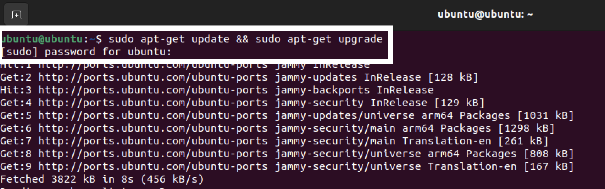
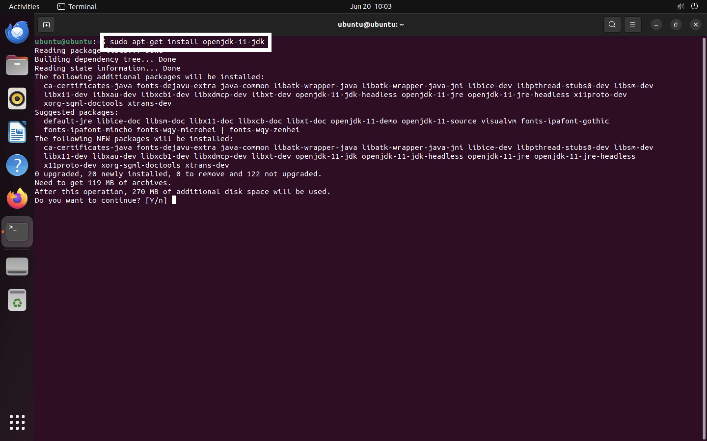
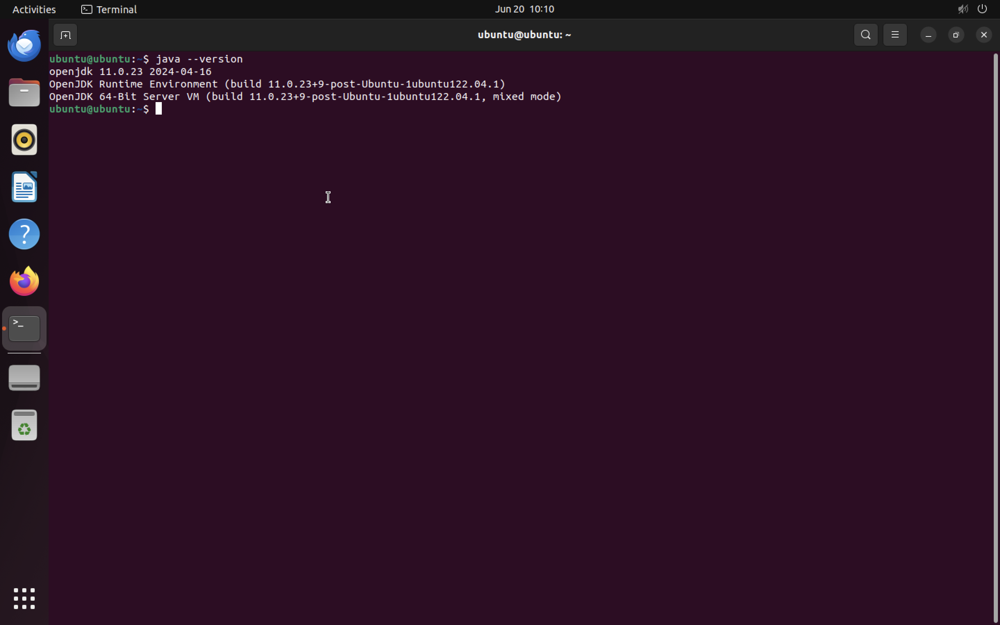
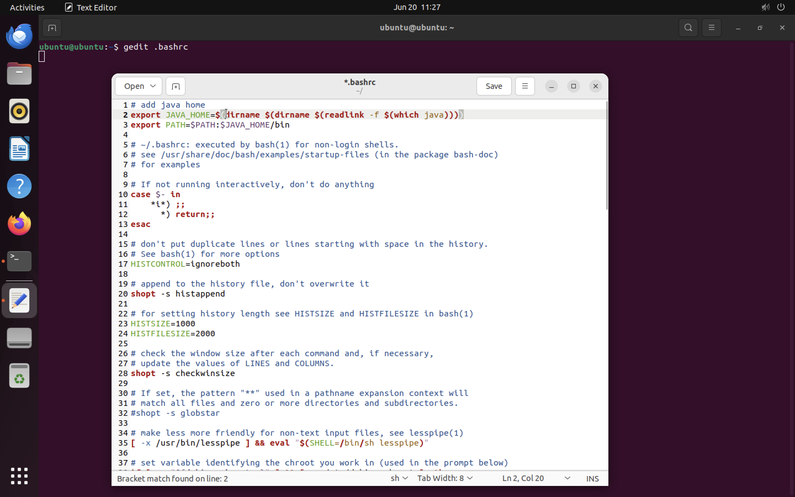
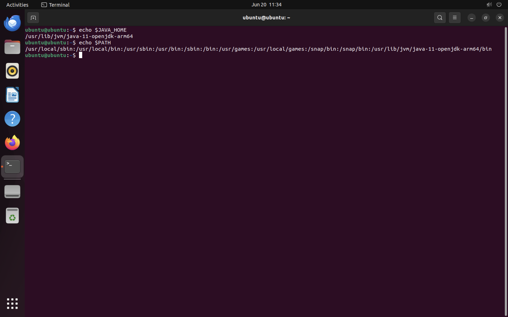

# INSTALL JAVA 11 ON UBUNTU

1. Open your teminal in ubuntu
2. Ensure your system is up-to-date By carrying out this order in terminal
```sh
sudo apt-get update && sudo apt-get upgrade
```


2. Install the OpenJDK 11 development kit, which includes OpenJRE 11 -> click Y if If the question arises Do you want to continue ? [Y/n]
```sh
sudo apt-get install openjdk-11-jdk
```


3. Check the version of the JRE to verify that it has been properly installed
```sh
java -version
```


4. Set Environment Variables. Open the ~/.bashrc with by running this command in the terminal
```sh
gedit .bashrc 
```
And add this code at the top line
```sh
# add java home
export JAVA_HOME=$(dirname $(dirname $(readlink -f $(which java))))
export PATH=$PATH:$JAVA_HOME/bin
```

Save and Close

5. Reload the ~/.bashrc file by running this command
```sh
source ~/.bashrc
```

6. Verify that the JAVA_HOME and PATH variables were set correctly
```sh
echo $JAVA_HOME
echo $PATH
```
