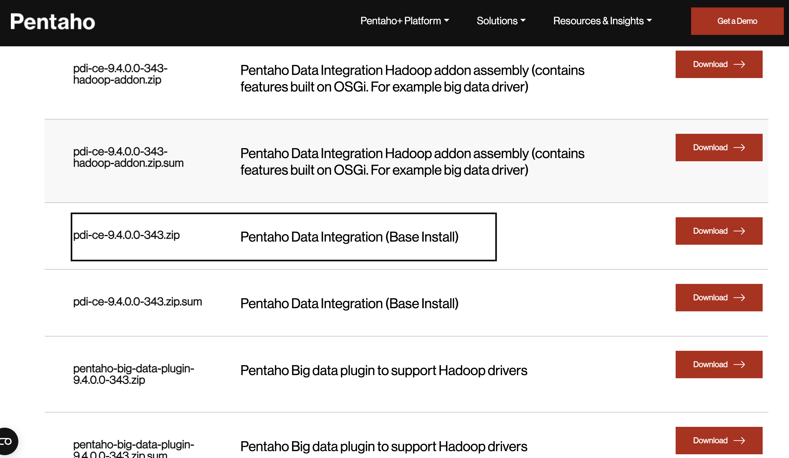
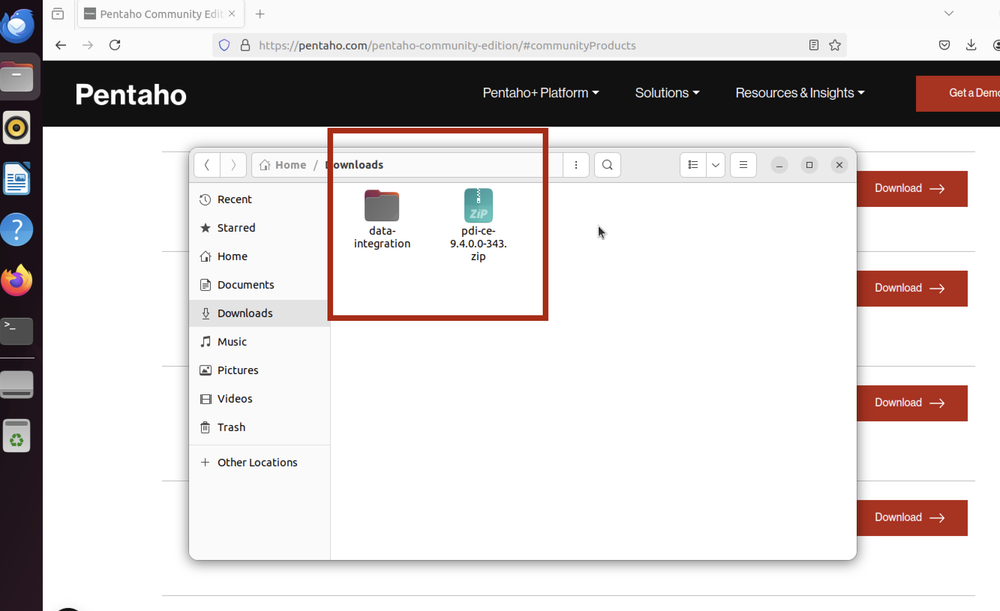
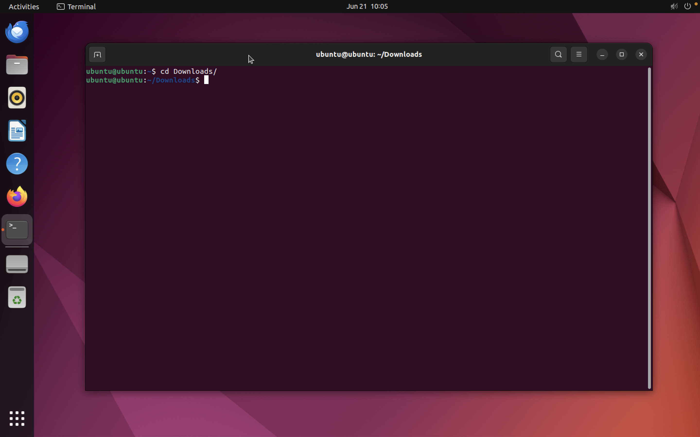
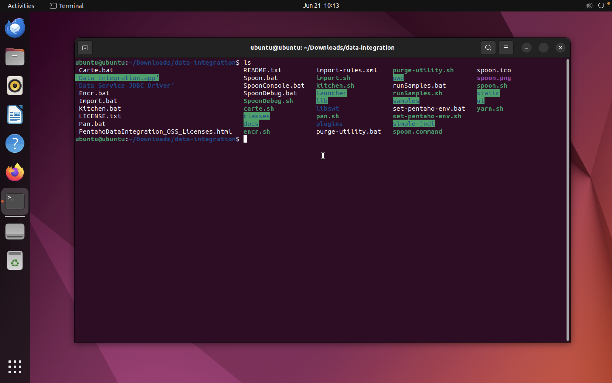
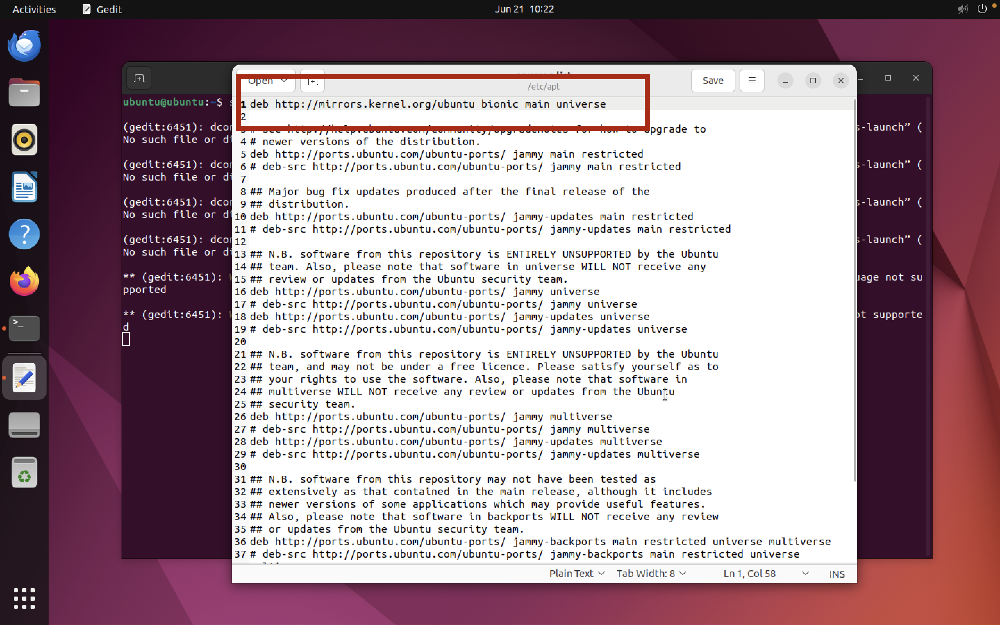
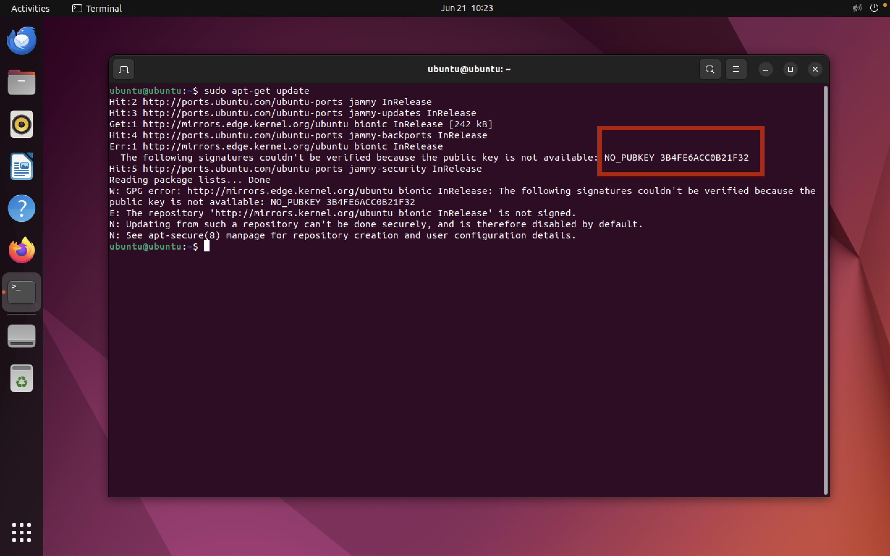
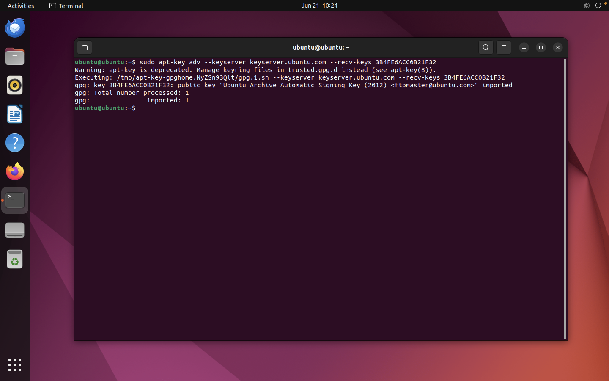

# INSTALL PENTAHO DATA INTEGRATION ON UBUNTU

1. Before you install pentaho, install java first in step 4
2. Open website pentaho in here : <a href='https://pentaho.com/pentaho-community-edition/' target='_blank'>open</a> and enter the data in the form in order to get access to download
3. After you complete the data, you will get a popup like this

check the checkbox and click red button

4. And you will be directed to a view like this

download pdi-ce-9.4.0.0-343.zip pentaho data integration

5. Extract the downloaded file pdi zip in download folder and you will get a folder data-integration


6. Open your terminal and sign into a folder download using the order
```sh
cd Downloads/
```


7. Re enter into the folder data-integration using the order
```sh
 cd data-integration/
```

8. If you have entered in folder data-integration, Try running orders
```sh
 ls
```
and you will get output like this


9. Run this order
```sh
./spoon.sh
```
And maybe you will get an error about no libwebkitgtk-1.0 detected

10. Add LIBWEBKITGTK-1.0-0 ON UBUNTU
11. Open your teminal and run this order
```sh
sudo gedit /etc/apt/sources.list
```
and enter this code in the top row
```sh
deb http://mirrors.kernel.org/ubuntu bionic main universe
```

click save and close

12. Run the command 
```sh
sudo apt-get update
```
And you will get a look like this


13. Execute the following command where the last HEX string corresponds to the returned to you
```sh
sudo apt-key adv --keyserver keyserver.ubuntu.com --recv-keys 3B4FE6ACC0B21F32
```


14. Repeat the installation procedure with:
```sh
sudo apt-get update

sudo apt-get install libwebkitgtk-1.0-0
``` 

15. Run again command in folder data-integration
```sh
./spoon.sh
```
