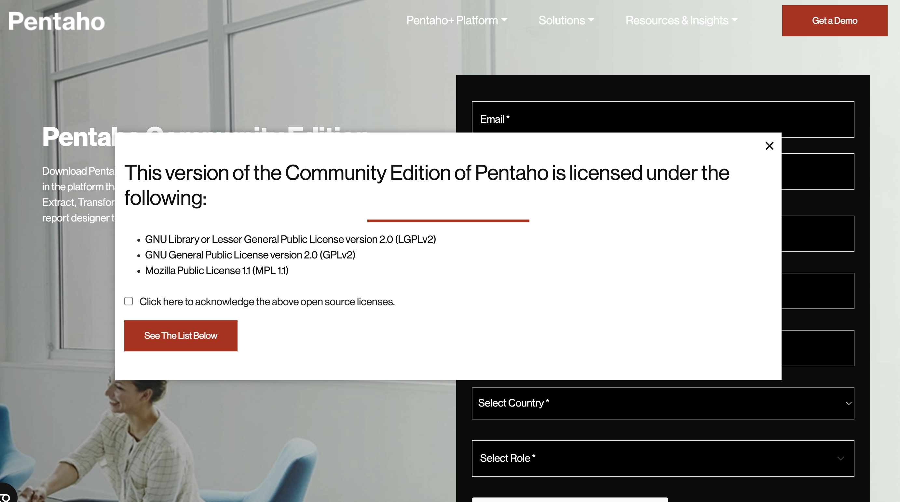

# INSTALL PENTAHO DATA INTEGRATION ON UBUNTU

1. Before you install pentaho, install java first in step 4
2. Open website pentaho in here : <a href='https://pentaho.com/pentaho-community-edition/' target='_blank'>open</a> and enter the data in the form in order to get access to download
3. After you complete the data, you will get a popup like this

check the checkbox and click red button

4. And you will be directed to a view like this

download pdi-ce-9.4.0.0-343.zip pentaho data integration

5. Extract the downloaded file pdi zip in download folder and you will get a folder data-integration

6. 
