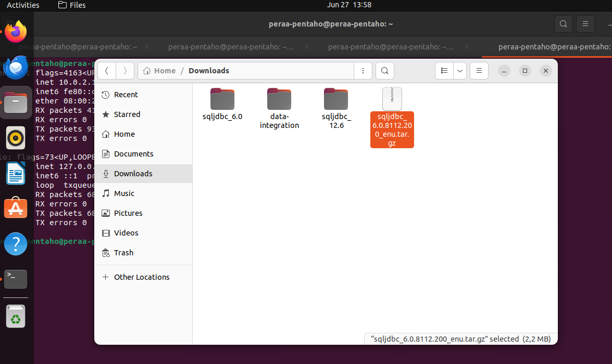
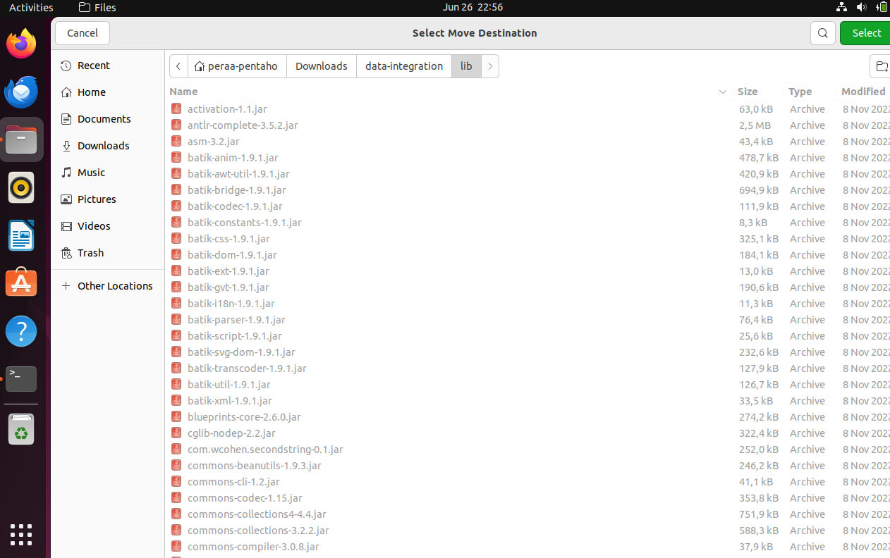

# INSTALL DRIVER SQL SERVER FOR PENTAHO DATA INTEGRATION

1. Because pentaho does not have help tools for connecting to sql server, therefor we must download manually SQL Server Driver.

2. Download driver sql server in <a href='https://learn.microsoft.com/en-us/sql/connect/jdbc/download-microsoft-jdbc-driver-for-sql-server?view=sql-server-ver16' target='_blank'>here</a>

3. You cant see documentation about sql server driver in <a href='https://learn.microsoft.com/en-us/sql/connect/jdbc' target='_blank'>here</a>

4. Open your folder download and you cant see zip file about sqljdbc as show below


5. Extract your file zip by clicking two times 
6. Move the jar file that is on the folder
```sh
Download/sqljdbc_<version>_/enu/jars/sqljdbc_<version>_.jre8.jar
```
move to the file
```sh
Download/data-integration/lib/
```


7. Now that the JDBC drivers have been copied to the appropriate folders, re-start the pentaho data integration by launch tools ./spoon.sh

