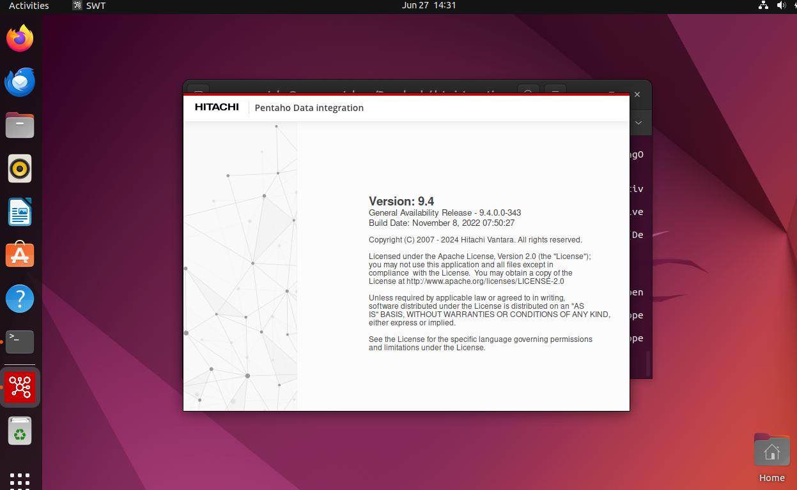
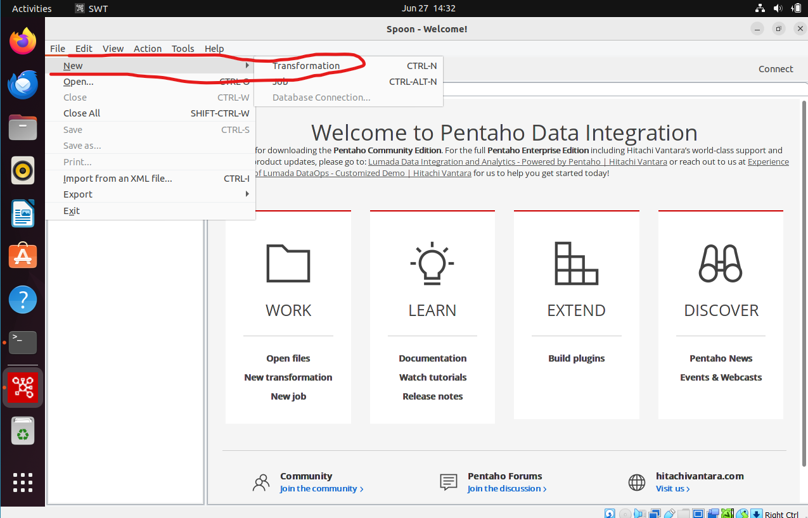
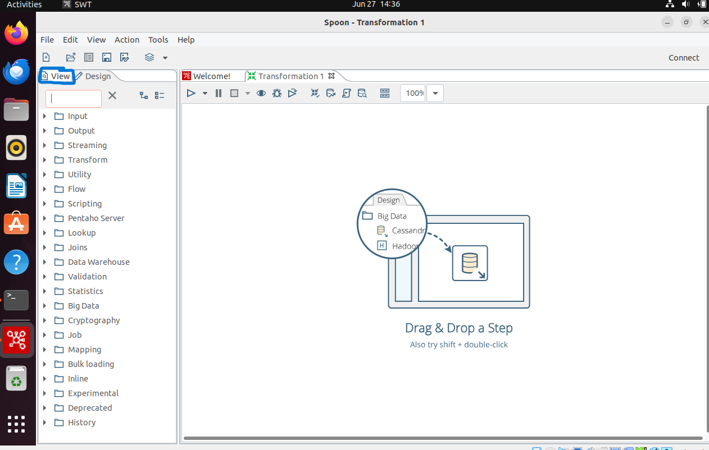
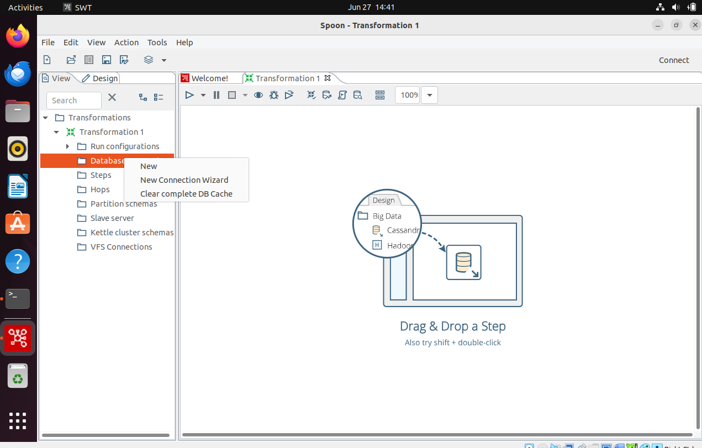
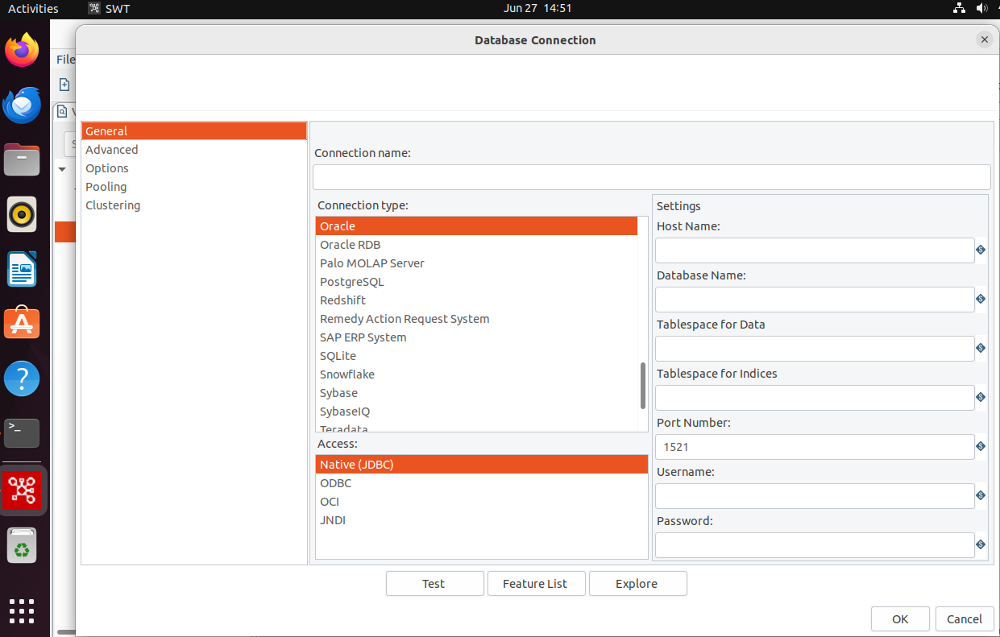

# TEST CONNECTION TO SQL SERVER FROM PENTAHO

1. Now lets try to test the connection database from pentaho to SQL Server

2. Open your terminal and Re enter into the folder data-integration using the order
```sh
 cd Download/data-integration/
```

3. After your have entered the folder data-integration, please launch ./spoon.sh and the window of pentaho application will be open automatically


4. After the application is completely open, you can click file -> New -> Transformation , 


5. After that you will get an application display like this

Please click view which is given a blue sign

6. Right click on the connection database folder as show below

Click New and you will get pop-up Database Connection as show below
