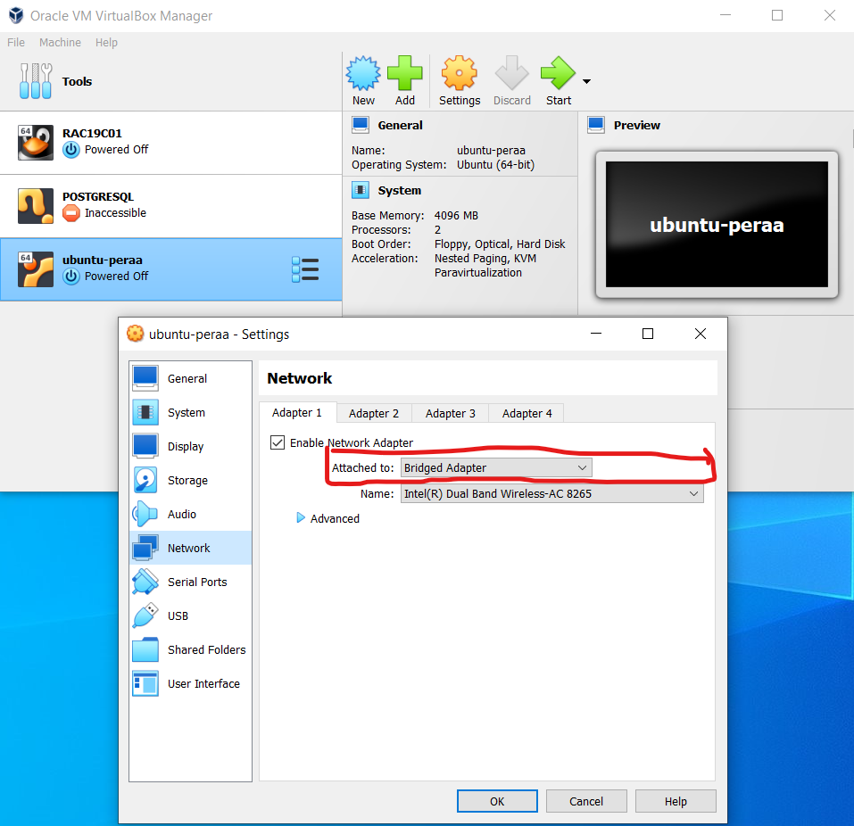
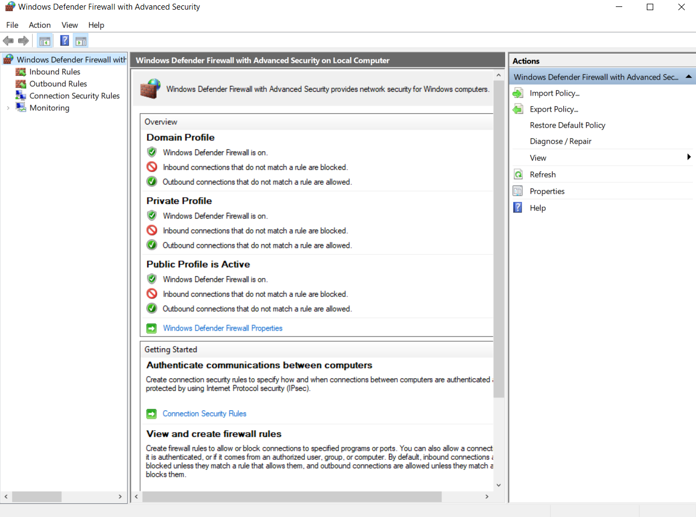
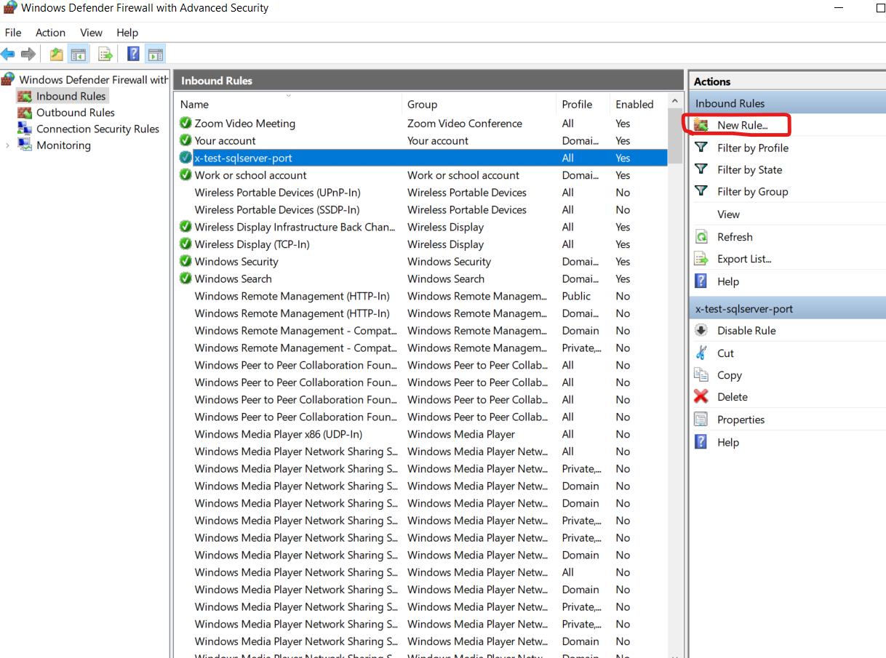
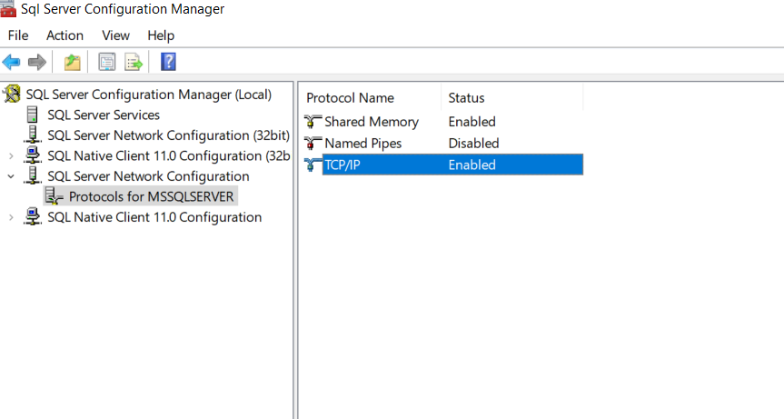
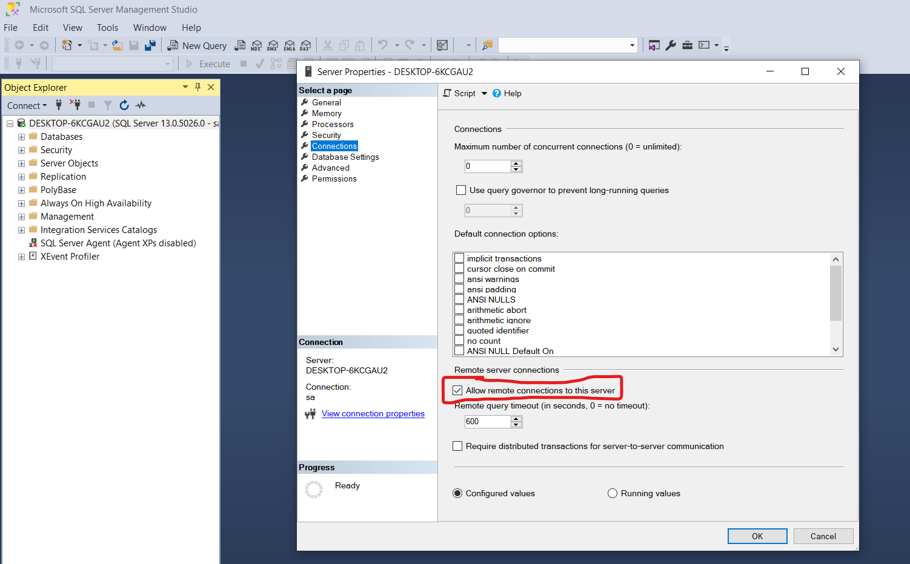
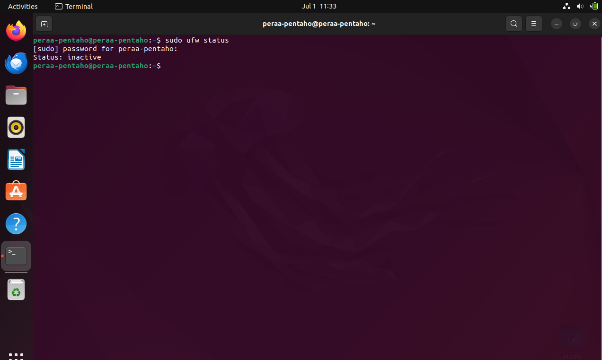
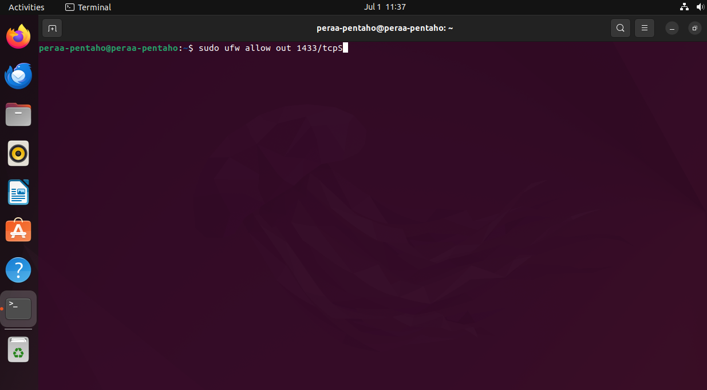
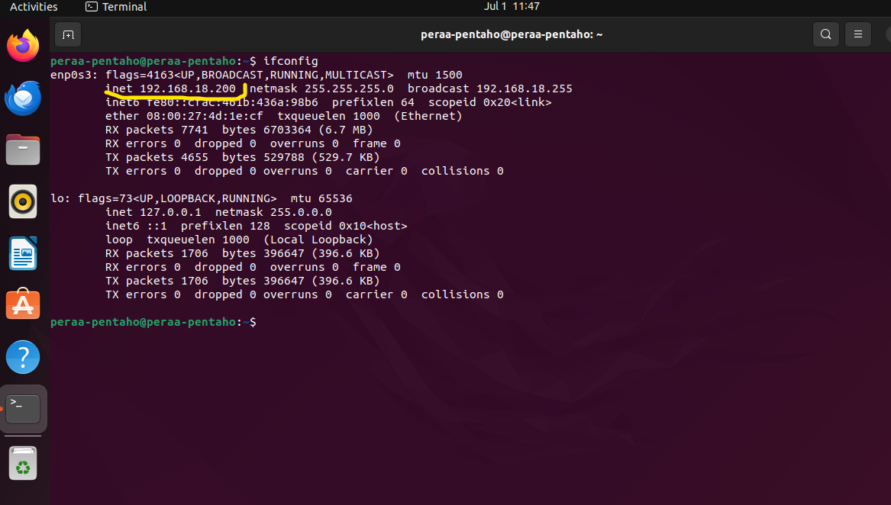
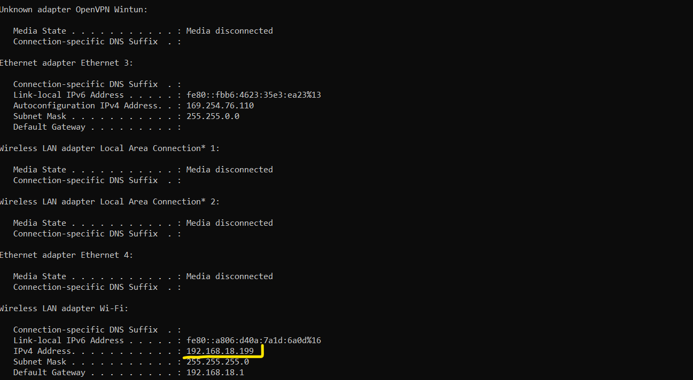
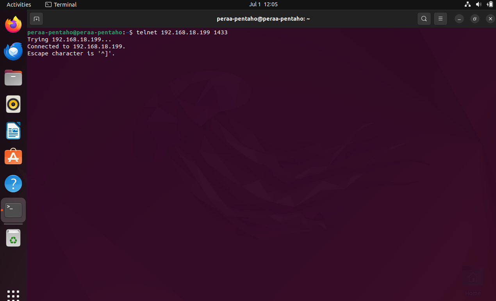

# SETUP OPERATING SYSTEM

Before we really use the pentaho from virtual machine engine to host windows, We have to setup a few things both at the host windows and in the virtual meachine.

1. Setup network virtual machine to bridged adapter

    open your virtual machine and click setting -> in the left sidebar, go to network and setting adapter 1 to Bridged Adapter.



### SETUP ON THE HOST MACHINE

1. Allow SQL Server through windows firewall
- Open ` Windows Firawall with Advanced Security `

- Create a new inbound rule to allow TCP port 1433 ( default SQL Server port )


2. Enable TCP/IP 
- Open SQL Server Configuration Manger
- Go to SQL Server Network Configuration -> Protocols for [YourInstance]
- Enable TCP/IP


3. Verify SQL Server Configuration Using SMSS
- Open SQL Server Management Studio (SSMS)
- Ensure that the server is configured to allow remote connections
    - Rigth-Click on the server in Object Explorer and Select Properties
    - Go to the Connections page and ensure Allow Remote connections to this server is Checked



### SETUP ON THE UBUNTU VIRTUAL MACHINE

1. Check UFW Status 
- Check the status of UFW


- if UFW is active, allow outgoing traffic to the SQL server port 1433


- if you need to allow incoming trafic from specific IP ranges, you can use :
```sh
sudo ufw allow from <your_windows_host_ip> to any port 1433
```

### Additional Network Check

1. Check your ip address ubuntu vm


2. Check your ip address host windows


3. Ping ip address host windows on ubuntu vm with command :
```sh
ping <your_windows_host_ip>
```

4. Ping ip address ubuntu vm on host windows with command :
```sh
ping <your_ubuntu_vm_ip>
```

5. Telnet to SQL Server Port, Check if you can connect to the SQL Server Port :
```sh
telnet <your_windows_host_ip> 1433
```


6. if Telnet is not installed, you can install it using :
```sh
sudo apt-get install telnet
```

Now you should have communicated each other 2 machine ( host windows and ubuntu virtual machine ) and can be used for the SQL server database connection to windows host


#### <a href='https://github.com/geetoor-maven/pentaho/blob/master/8_RUNNING_SH_FILE.md'>Next Step</a>