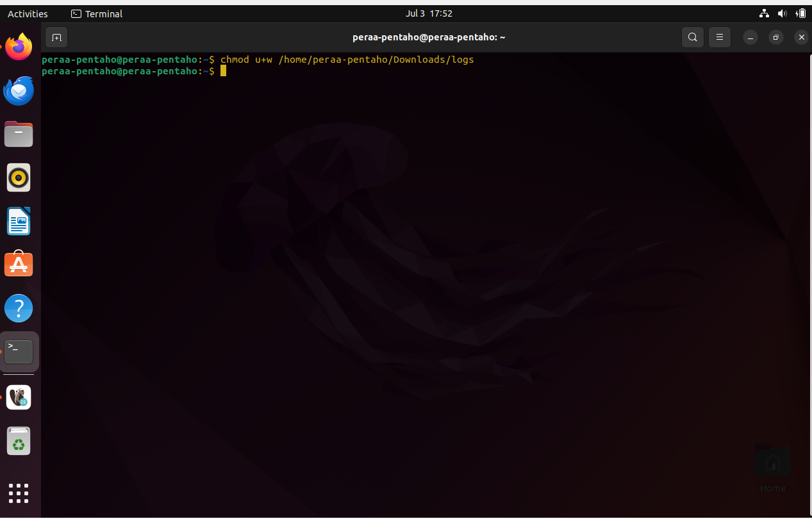

# RUNNING SH FILE ON VIRTUAL MACHINE

Before running the SH file. there are several steps that must be considered.

1. Please download sh and ktr file in google drive that has been provided, Download using mozilla app that is inside in your ubuntu machine. 

2. Create 3 folders in the download folder
```sh
sh
transformation
logs
```


3. For SH files that your have downloaded, can be moved to the SH folder that has just been made, and For ktr files that your have download, can be moved also to the transformation folder that has jus been made.

4. Running chmod u+w /path_log_folder so that the file log can be created when running the SH file
```sh
chmod u+w /home/peraa-pentaho/Downloads/logs
```


5. Open SH file with command line gedit in the terminal app.
```sh
gedit <your_sh_file>
```

6. After the SH file is open, You will see the code like the image below


7. Define value variables for your connection slq server.
```sh
SQL_SERVER_HOST = "your_server_host"
SQL_SERVER_PORT = "sql_server_port"
SQL_SERVER_DB = "your_db_name"
SQL_SERVER_USER = "your_user_name"
SQL_SERVER_PASSWORD = "your_password"
```

8. For value variable for connection postgres, no need to be contested

9. Save your SH file and close text editor

10. Run chmod command line, so that SH files can be run.
```sh
chmod +x <your_sh_file>
```

11. Now you can run your SH file with command superadmin :
```sh
sudo ./your_sh_file.sh
```
