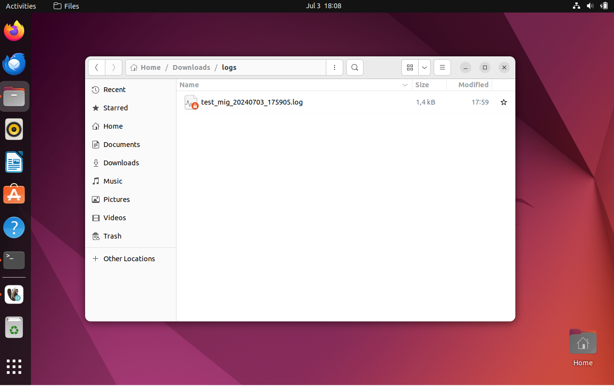

# CHECK LOG FILE

If you want to check the error message or success in the SH code that you run, you can follow this step :

1. Go to logs folder and you can see log file by the name your_ktr_file_current_time.log

2. Open your log file and you can see the error message
