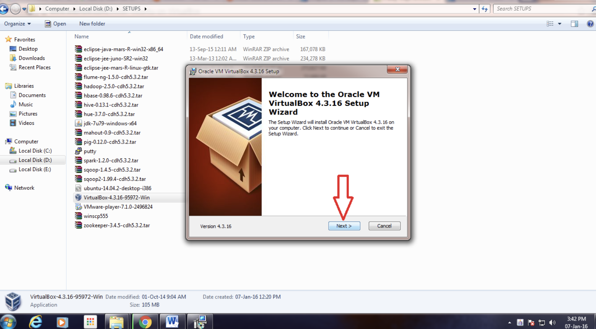
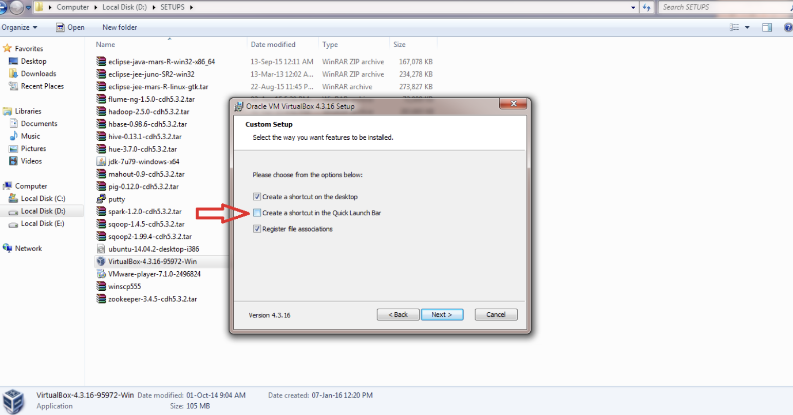

<h1 align='center'>Installation pentaho on ubuntu 22.04</h1>

## install virtual box

- install virtual box the latest version according to your operating system : https://www.virtualbox.org/wiki/Download_Old_Builds_7_0
ㅤ
- After being downloaded, double click downloaded files And you will get a look like this 

- click next
- and then Uncheck “Create a shortcut in the Quick Launch Bar” and click “Next”

- and then, click yes
- and click install
