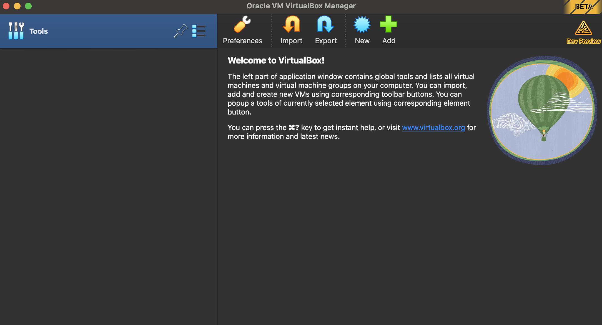

<h1 align='center'>Guidebook Pentaho on Ubuntu 22.04</h1>

## 1. install virtual box

- install virtual box the latest version according to your operating system : https://www.virtualbox.org/wiki/Download_Old_Builds_7_0
ㅤ
- After being downloaded, You can install Virtual Box with tutorials found on Google : 
- https://data-flair.training/blogs/install-virtualbox/
- https://www.geeksforgeeks.org/how-to-install-virtualbox-on-windows/

- If successful, you can open a virtual box and get a look like this

## 2. Create VM Ubuntu 22.04 in Virtual Box
- install iso ubuntu 22.04 