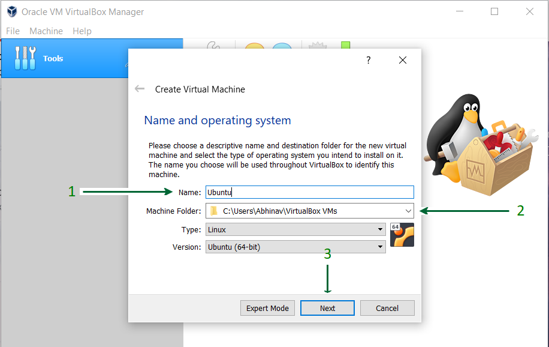
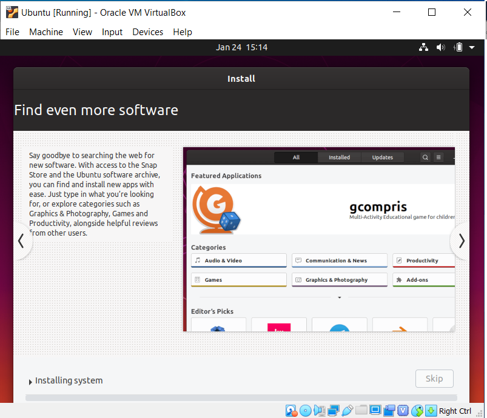

<h1 align='center'>Guidebook Pentaho on Ubuntu 22.04</h1>

## 1. install Virtual Box

1. install virtual box the latest version according to your operating system : https://www.virtualbox.org/wiki/Download_Old_Builds_7_0
ㅤ
2. After being downloaded, You can install Virtual Box with tutorials found on Google : 
- https://data-flair.training/blogs/install-virtualbox/
- https://www.geeksforgeeks.org/how-to-install-virtualbox-on-windows/

3. If successful, you can open a virtual box and get a look like this

## 2. Create VM Ubuntu 22.04 in Virtual Box

1. install iso ubuntu 22.04 : <a href='https://releases.ubuntu.com/jammy/ubuntu-22.04.4-desktop-amd64.iso' target='_blank'>Download Here</a>

2. After you download iso ubuntu 22.04 -> Open your Virtual Box and Create New Virtual Machine.

3. Give your virtual machine name with the name ubuntu, and the type is Linux and the version is Ubuntu(64-bit) and click next

4. For good performance Adjust RAM to 4GB (4096 MB) or less according to your system configuration.

5. Let the "Create a virtual hard disk now" option selected and proceed to the next step

6. Select the type of Hard disk. Using VDI type is recommended.

7. Either of the Physical Storage types can be selected. Using a Dynamically Allocated Disk is by default recommended.

8. Select Disk Size and provide the Destination Folder to install and Allocate about Minimum 30GB of virtual space. and click Create

## 3. Starting Ubuntu Virtual Machines 22.04

1. After all the steps above are complete, you will see a new virtual machine created on your VirtualBox. Select it from the left side panel and press the Start button.

2. and then add ISO Ubuntu 22.04 that you have downloaded on the second step to VirtualBox

3. Click Start and Virtual machines begin.
4. You will see the Grub menu as the first screen to choose "Ubuntu" to boot with it.
5. Click on the Install Ubuntu option
6. Select Keyboard Layout, if the defaults are compatible, just click on the Continue button and proceed.
ㅤ

7. Select Installation Type. By default, it is set to Normal Installation
ㅤ

8. and then Click on the Install Now button and carry on with the installation
ㅤ

9. Click on the Continue button, and proceed with writing changes on the disk.
10. Select your Location to set the Time Zone.
11. Choose a Name for your computer and set a Password to secure login info.
12. Wait for the installation process to complete.

13. Once the installation process is over, reboot your Virtual Machine.
14. Yuhuuuu....You’re finished with the installation process
