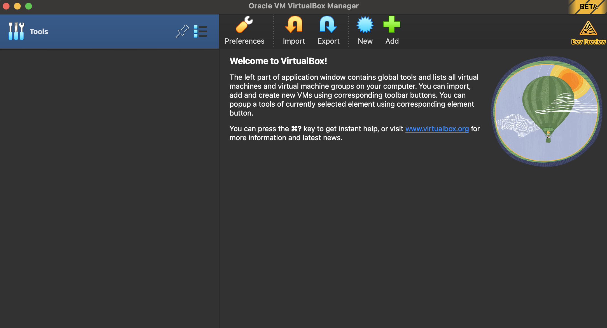

# install Virtual Box

1. install virtual box the latest version according to your operating system : https://www.virtualbox.org/wiki/Download_Old_Builds_7_0
ㅤ
2. After being downloaded, You can install Virtual Box with tutorials found on Google : 
- https://data-flair.training/blogs/install-virtualbox/
- https://www.geeksforgeeks.org/how-to-install-virtualbox-on-windows/

3. If successful, you can open a virtual box and get a look like this
